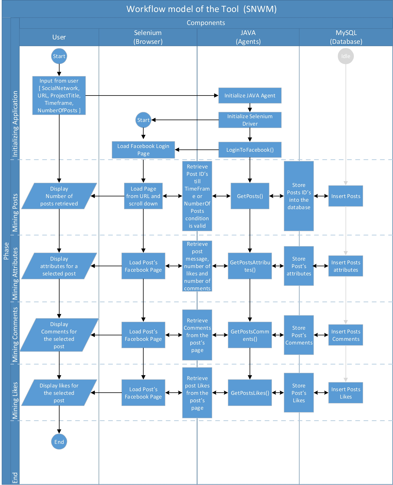

  
  
  

  

  <h2 align="center">Social Network Web Mining (SNWM) Tool workflow model</h2>
 
## Disclaimer
> The purpose of these roadmaps is to give you an idea about the landscape and to guide you if you are confused about what to learn next and not to encourage you to pick what is hip and trendy. You should grow some understanding of why one tool would better suited for some cases than the other and remember hip and trendy never means best suited for the job

## Introduction
 
Roadmap to becoming a Web Developer in 2019

   

Below you find a set of charts demonstrating the paths that you can take and the technologies that you would want to adopt in order to become a frontend, backend or a devops. I made these charts for an old professor of mine who wanted something to share with his college students to give them a perspective; sharing them here to help the community.

Check out my [blog](http://kamranahmed.info) and say "hi" on [Twitter](https://twitter.com/kamranahmedse).

## Frontend Roadmap

## Back-end Roadmap

## DevOps Roadmap

## ?? Wrap Up

If you think any of the roadmaps can be improved, please do open a PR with any updates and submit any issues. Also, I will continue to improve this, so you might want to watch/star this repository to revisit.

## ?? Contribution

> Have a look at [contribution docs](./contributing.md) for how to update any of the roadmaps

- Open pull request with improvements
- Discuss ideas in issues
- Spread the word
- Reach out with any feedback 

## Sponsored By	

 - [**Hackr.io** - Best Online Programming Courses & Tutorials Recommended by the Programming Community](https://hackr.io)
 - [**Noon** – Develop, Document, Test and Monitor your APIs](https://noon.sh/)
 
## License

