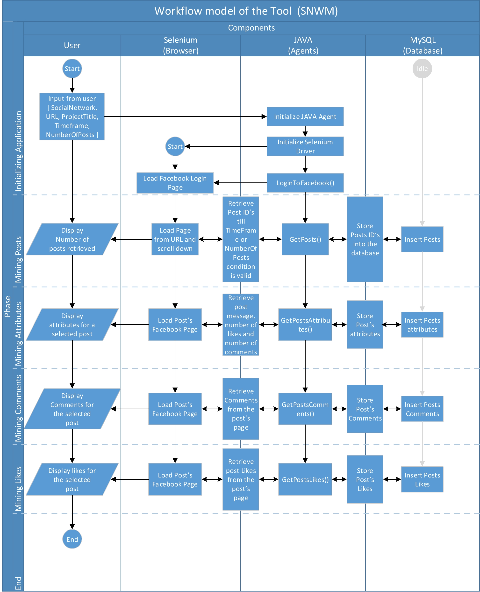

  
  
  

  

  <h2 align="center">Social Network Web Mining (SNWM) Tool workflow model</h2>
 

## Introduction

This section presents the workflow model of the SNWM tool. SNWM workflow model is partitioned with respect to components and phases. The workflow is divided into four components and six phases. This workflow model is inspired by the model presented by Matthias Schur [1].

## Components 

## Phases

## Explanation

## References

[1] Schur, M., Roth, A., & Zeller, A. (2015). "Mining workflow models from web applications". IEEE Transactions on Software Engineering, 41(12), 1184-1201.

## Disclaimer
> This tool is developed using open source technologies such as Java, MySQL, and Selenium. Author / GitUser developed this tool for mining public data from the social network websites (e.g. Facebook). Data available on the social network websites is their property and should be used with their permission, however, this tool only mines data that is searchable by Google (anyone can view the public data available on the social networks). This tool is developed for research purposes only and should not be used for financial purposes or to do ill to others. 
